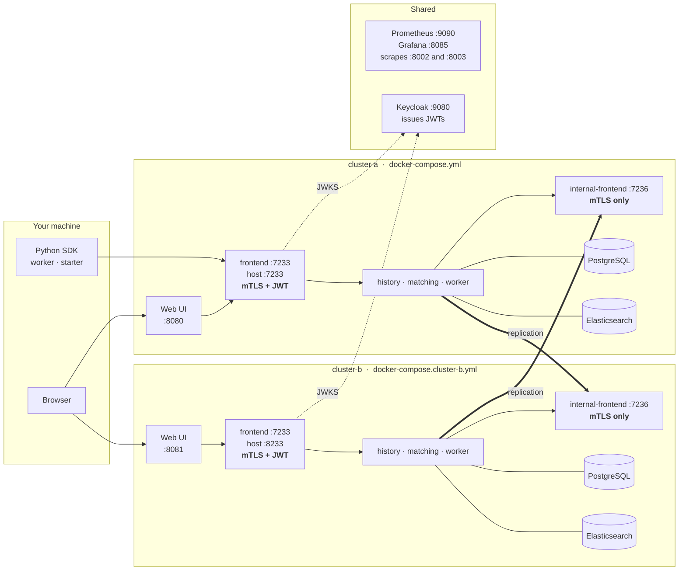
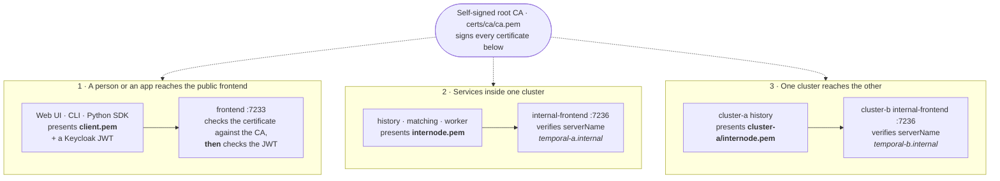

# Temporal: JWT Authentication + Cross-Cluster Replication over mTLS

Two Temporal clusters running locally in Docker, replicating to each other over
mutually-authenticated TLS, with Keycloak-issued JWTs guarding the public
frontend of each one.

- `docker-compose.yml` - **cluster-a**, plus the shared Keycloak, Prometheus and Grafana
- `docker-compose.cluster-b.yml` - **cluster-b**, the replication peer
- `config/cluster-a/config.yaml`, `config/cluster-b/config.yaml` - the server configuration for each cluster
- `scripts/generate-certs.sh` - the self-signed CA and all certificates
- `scripts/setup-keycloak.sh` - the Keycloak realm, client, role, claim mapper and user
- `scripts/connect-clusters.sh` - joins the two clusters and creates a global namespace
- `scripts/verify-replication.sh` - checks that replication *and* mTLS are actually working
- `scripts/test.sh` - quick smoke check of both clusters' TLS and cluster lists

| | cluster-a | cluster-b |
|---|---|---|
| Frontend (gRPC) | `localhost:7233` | `localhost:8233` |
| Internal frontend | `temporal:7236` | `temporal-b:7236` |
| Web UI | http://localhost:8080 | http://localhost:8081 |
| Server metrics | http://localhost:8002/metrics | http://localhost:8003/metrics |
| Elasticsearch | `localhost:9200` | `localhost:9201` |
| Initial failover version | 1 | 2 |

Shared by both: Keycloak (http://localhost:9080), Prometheus
(http://localhost:9090), Grafana (http://localhost:8085).

## Architecture

Each cluster is one `temporal` container running all five server roles, with
its own PostgreSQL and Elasticsearch behind it. The two clusters share a Docker
network, a Keycloak, and a Prometheus/Grafana pair.

The thick lines are the replication streams. Note where they land: each
cluster's history service dials the *other* cluster's internal frontend, never
its public one.



Three kinds of connection, three different ways of proving who you are - all of
them anchored in one self-signed root CA:



Path 1 is the only one that involves a token. Paths 2 and 3 are certificates
alone, which is what makes replication possible: a replication stream has no
user behind it and no JWT to present.

## Prerequisites

- [Docker](https://docs.docker.com/engine/install/) (includes Docker Compose)
- `openssl` (for the certificate script)

## How it fits together

There are two different ways a caller proves who it is, on two different ports,
and the split is the heart of this setup.

**The public frontend (7233)** is what people and applications use. It requires
*both* a client certificate and a Keycloak JWT. Neither alone gets you in.

**The internal frontend (7236)** is what machines use: this cluster's own
system workers, and the peer cluster's replication stream. It runs without the
JWT authorizer, because a replication stream has no user behind it and no token
to carry. It is not open, though - it sits behind the internode TLS
configuration, which sets `requireClientAuth`, so a caller still has to present
a certificate signed by the shared CA. Certificates are the authentication
mechanism between clusters; tokens are the authentication mechanism for people.

That is why `clusterMetadata.clusterInformation.<cluster>.rpcAddress` in each
config points at port 7236 rather than 7233.

### Certificates

`scripts/generate-certs.sh` issues everything from one self-signed root CA that
both clusters trust:

```
certs/ca/ca.pem                   root CA
certs/cluster-a/internode.pem     cluster-a's internode + internal-frontend identity,
                                  and the client certificate it presents to cluster-b
certs/cluster-a/frontend.pem      what the public frontend presents to clients
certs/cluster-a/client.pem        what the Web UI, CLI and SDK present to the frontend
certs/cluster-b/...               the same three for cluster-b
```

For separate per-cluster CAs, run the script twice with different `CERTS_DIR`
values and list both CA files under `clientCaFiles` and `rootCaFiles` in each
config.

#### Subject alternative names

| Certificate | CN | SANs |
|---|---|---|
| `certs/cluster-a/internode.pem` | `temporal-a.internal` | `temporal-a.internal`, `temporal`, `localhost`, `127.0.0.1` |
| `certs/cluster-a/frontend.pem` | `temporal` | `temporal`, `temporal-a.internal`, `localhost`, `127.0.0.1` |
| `certs/cluster-a/client.pem` | `cluster-a-client` | `cluster-a-client` |
| `certs/cluster-b/internode.pem` | `temporal-b.internal` | `temporal-b.internal`, `temporal-b`, `localhost`, `127.0.0.1` |
| `certs/cluster-b/frontend.pem` | `temporal-b` | `temporal-b`, `temporal-b.internal`, `localhost`, `127.0.0.1` |
| `certs/cluster-b/client.pem` | `cluster-b-client` | `cluster-b-client` |

Host verification stays enabled everywhere, so the name that matters in practice
is whichever one the TLS client pins as `serverName` - that pin is what gets
verified, not the address that was dialed:

| Connection | `serverName` verified |
|---|---|
| cluster-a internode (including its internal frontend) | `temporal-a.internal` |
| cluster-b internode (including its internal frontend) | `temporal-b.internal` |
| clients -> cluster-a public frontend | `temporal` |
| clients -> cluster-b public frontend | `temporal-b` |
| cluster-a -> cluster-b (replication) | `temporal-b.internal` |
| cluster-b -> cluster-a (replication) | `temporal-a.internal` |

The `.internal` names exist precisely because internode traffic dials container
IPs off the membership ring. No certificate can enumerate the IPs a Docker
bridge might hand out, so the pin is what lets host verification stay on.
`localhost` and `127.0.0.1` are on the frontend certificates so the Python SDK
can connect from the host. The client certificates need no useful SAN, because
they are only ever checked as client certificates.

The hostnames are overridable at generation time - `CLUSTER_A_INTERNAL_NAME`,
`CLUSTER_B_INTERNAL_NAME`, `CLUSTER_A_HOST`, `CLUSTER_B_HOST` in
`scripts/generate-certs.sh` - but changing one means changing the matching
`serverName` in both `config/cluster-a/config.yaml` and
`config/cluster-b/config.yaml` too.

## Running it

```bash
git clone <this repo>
cd temporal-replication
cp .env.example .env
```

**1. Generate the PKI.**

```bash
./scripts/generate-certs.sh
```

**2. Set up Keycloak.** Bring up just Keycloak, then create the realm, client,
role, claim mapper and user that the servers expect:

```bash
docker compose up keycloak -d
./scripts/setup-keycloak.sh
```

The script writes the client secret it generates into `KEYCLOAK_CLIENT_SECRET`
in your `.env`, which is where the rest of the stack reads it from. Every step
is idempotent, so re-running it is safe.

**3. Start cluster-a.** This also creates the `temporal-network` bridge that
cluster-b joins.

```bash
docker compose up -d
```

**4. Start cluster-b.**

```bash
docker compose -f docker-compose.cluster-b.yml up -d
```

**5. Join the two clusters** and create a global namespace (`replicated`) that
lives on both, active on cluster-a:

```bash
./scripts/connect-clusters.sh
```

The script registers each cluster with the other, waits for the cluster lists to
refresh, creates the namespace on cluster-a, and does not return until that
namespace has replicated to cluster-b.

## Checking that replication works

```bash
./scripts/verify-replication.sh
```

Forty-odd assertions across seven areas, exiting non-zero if any of them fail:

1. **Certificates** - every leaf chains to the CA, is not about to expire, and
   carries the extended key usages and SANs its role needs.
2. **mTLS on the internal frontend**, the endpoint replication actually uses.
   Both the positive case and three negative ones: no client certificate,
   plaintext gRPC, and a well-formed certificate signed by an untrusted CA. The
   last one matters most - it is the difference between "a certificate is
   required" and "*your* certificate is required".
3. **The public frontend** still wants both doors unlocked: it serves the right
   certificate, asks callers for one, and rejects a valid certificate that
   arrives without a JWT.
4. **Cluster registration** - each side sees both clusters, at the expected
   addresses, with connections enabled and distinct initial failover versions.
5. **Namespace replication** - the global namespace exists on both sides and is
   the *same* namespace, compared by ID rather than by name.
6. **Workflow history replication** - starts a probe workflow on whichever
   cluster is active, waits for the same run ID to appear on the standby, and
   cleans up after itself.
7. **Failover** - opt-in with `--failover`. Flips the namespace to the other
   cluster, checks that the *old* active cluster learns about it (which only
   happens if replication flows both ways), checks the failover version
   advanced, and flips back.

Useful flags: `--failover` to include section 7, `--keep` to leave the probe
workflow running, `GLOBAL_NAMESPACE=...` to check a different namespace.

The negative checks are the point. A cluster with TLS configured but not
enforced passes every positive test.

### By hand

Start a workflow on cluster-a and look for it on cluster-b:

```bash
docker exec temporal-admin-tools temporal workflow start \
  -n replicated --task-queue xdc-demo --type Smoke --workflow-id smoke-1 \
  --address temporal:7236 --tls \
  --tls-ca-path /etc/temporal/certs/ca/ca.pem \
  --tls-cert-path /etc/temporal/certs/cluster-a/internode.pem \
  --tls-key-path /etc/temporal/certs/cluster-a/internode.key \
  --tls-server-name temporal-a.internal

docker exec temporal-b-admin-tools temporal workflow describe \
  -n replicated -w smoke-1 \
  --address temporal-b:7236 --tls \
  --tls-ca-path /etc/temporal/certs/ca/ca.pem \
  --tls-cert-path /etc/temporal/certs/cluster-b/internode.pem \
  --tls-key-path /etc/temporal/certs/cluster-b/internode.key \
  --tls-server-name temporal-b.internal
```

The same run ID should appear on both sides within a second or two.

To fail the namespace over to cluster-b:

```bash
docker exec temporal-b-admin-tools temporal operator namespace update \
  -n replicated --active-cluster cluster-b \
  --address temporal-b:7236 --tls \
  --tls-ca-path /etc/temporal/certs/ca/ca.pem \
  --tls-cert-path /etc/temporal/certs/cluster-b/internode.pem \
  --tls-key-path /etc/temporal/certs/cluster-b/internode.key \
  --tls-server-name temporal-b.internal
```

## Python SDK example

```bash
python3 -m venv .venv
source .venv/bin/activate
pip install temporalio python-keycloak python-dotenv
```

- Start the worker: `python3 worker.py`
- Start the workflow: `python3 simple_workflow.py`

Both connect to cluster-a's public frontend, so they present
`certs/cluster-a/client.pem` alongside the Keycloak JWT. To point them at
cluster-b instead:

```bash
TEMPORAL_ADDRESS=localhost:8233 \
TEMPORAL_TLS_CLUSTER=cluster-b \
TEMPORAL_TLS_SERVER_NAME=temporal-b \
python3 worker.py
```

`TEMPORAL_NAMESPACE` selects the namespace (`default` by default; use
`replicated` to exercise the replicated one).

## Stopping

```bash
docker compose -f docker-compose.cluster-b.yml down
docker compose down
```

Add `-v` to remove volumes. That wipes everything, including your Keycloak realm
configuration and both clusters' databases.

## Notes and gotchas

**An existing database from an older version of this stack will not start.**
Each cluster writes its identity into the `cluster_metadata_info` table on first
boot. The stack used to run as a single cluster named `active` with initial
failover version 1; cluster-a now uses the name `cluster-a` with the same
version, and the server refuses to start with two names claiming one version
(`panic: Cluster info initial versions have duplicates`). Run
`docker compose down -v` once before upgrading.

**After editing a `config.yaml`, recreate the container rather than restarting
it** - `docker compose up -d --force-recreate temporal`. Docker Desktop's file
sharing can keep serving a cached copy of a bind-mounted file to a
long-running container.

**cluster-b needs cluster-a's network.** `docker-compose.cluster-b.yml` joins
`temporal-network` as an external network, so start cluster-a first, or create
it by hand with `docker network create temporal-network`.

**`certs/` is gitignored.** It holds unencrypted private keys, and the script
leaves them world-readable so the server (running as uid 1000 behind a
read-only bind mount) can read them. That is fine for a local lab and nowhere
else.
